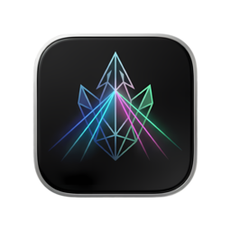

# AQW Refracted

<p align="center">
  
</p>

<p align="center">
  
  
</p>

AQW Refracted is a modern desktop companion for **Adventure Quest Worlds** ([aq.com](https://www.aq.com)). Built with **Electron**, it provides a native-like experience with Pepper Flash support, allowing you to play AQW games with improved performance and specialized tools.

## 🚀 Downloads

If you just want to play and don't want to build the app yourself, you can download the latest pre-built binaries from the **[Releases](https://github.com/riegan/aqw-refracted/releases)** page.

## Features

- **Native Flash Support** - Uses real Pepper Flash plugin instead of emulation
- **PepFlash Plugin Integration** - Cross-platform Pepper Flash plugin support (Windows, macOS, Linux)
- **Hardware Acceleration** - Custom Electron configuration for optimal GPU performance and hardware-accelerated rendering
- **High Performance** - Unlocked frame rate and optimized GPU settings for smooth gameplay
- **TypeScript** - Full TypeScript support with latest features
- **React 19** - Modern UI built with React 19
- **Tailwind CSS v3** - Utility-first styling
- **Debugger Integration** - Chrome DevTools for element inspection and input simulation

## Tech Stack

- **Electron 11.5.0** - Desktop framework (last version with PPAPI Flash support)
- **PepFlash Plugin** - Native Pepper Flash plugin from clean-flash-builds
- **React 19** - UI library
- **TypeScript** - Type-safe development
- **Vite** - Build tool for renderer process
- **Tailwind CSS v3** - Styling
- **Radix UI + shadcn/ui** - UI components

## Prerequisites

1. **Node.js** (latest LTS)
2. **pnpm** package manager
3. **[Task](https://taskfile.dev)** (optional) - Used for simplified development and build commands

## Setup

### 1. Install Dependencies

```bash
pnpm install
```

### 2. Pepper Flash Plugin (Included)

The Pepper Flash plugins are included in this project via [clean-flash-builds](https://github.com/darktohka/clean-flash-builds) (pre-built releases from [CleanFlash](https://gitlab.com/cleanflash/installer)). No separate download or manual building is required.

Plugins are stored per-platform under `resources/ppapi-plugins/`:

```
resources/ppapi-plugins/
├── linux/libpepflashplayer.so
├── mac/libpepflashplayer.plugin
└── win/libpepflashplayer.dll
```

### 3. Development

```bash
pnpm dev
```

### 4. Build

```bash
# Build for Linux
pnpm dist:linux

# Build for Windows
pnpm dist:win

# Build for macOS
pnpm dist:mac

# Build for all platforms
pnpm dist:all
```

## Project Structure

```
aqw-refracted/
├── src/
│   ├── main/              # Electron main process
│   │   ├── index.ts       # Main entry with PepFlash setup
│   │   ├── constants.ts   # Window/constants config
│   │   ├── debugger.ts    # Chrome DevTools debugger
│   │   └── debugger-handler.ts  # Input simulation
│   ├── preload/           # Preload scripts
│   ├── renderer/          # React UI
│   └── assets/            # App icons
├── resources/ppapi-plugins/  # Per-platform Flash plugins
├── out/                   # Build output
└── dist/                  # Distribution packages
```

## Pepper Flash Configuration

The app configures Pepper Flash in `src/main/pepflash.ts` with cross-platform support using [clean-flash-builds](https://github.com/darktohka/clean-flash-builds) (pre-built releases from [CleanFlash](https://gitlab.com/cleanflash/installer)):

| Platform | Plugin | Version |
|----------|--------|---------|
| Windows  | `libpepflashplayer.dll` | 34.0.0.376 |
| macOS    | `libpepflashplayer.plugin` | 34.0.0.231 |
| Linux    | `libpepflashplayer.so` | 34.0.0.137 |

Plugins are stored per-platform under `resources/ppapi-plugins/`:

```
resources/ppapi-plugins/
├── linux/libpepflashplayer.so
├── mac/libpepflashplayer.plugin
└── win/libpepflashplayer.dll
```

At startup, the plugin is resolved from these paths (first match wins):

1. `<cwd>/resources/ppapi-plugins/<platform>/`
2. `<resourcesPath>/ppapi-plugins/<platform>/`
3. `<appPath>/resources/ppapi-plugins/<platform>/`

In production builds, electron-builder bundles only the plugin for the target platform via per-platform `extraResources` configuration.

## Important Notes

- **Electron 11.5.0** is the last version that supports the Pepper Flash plugin (Chrome 87 was the last to support Flash, removed in Chrome 88/Electron 12+)
- **macOS Users**: If you see "App is damaged and cannot be opened" when running the app, use this command in your terminal to allow it to run:
  ```bash
  sudo xattr -cr /path/to/AQW\ Refracted.app
  ```
- **macOS M-series (Apple Silicon) users**: Rosetta 2 is required to run this application

## Code Quality

```bash
# Type checking
pnpm typecheck

# Linting
pnpm lint

# Formatting
pnpm format
```

## Acknowledgments

- clean-flash-builds - Pre-built Flash Player releases (https://github.com/darktohka/clean-flash-builds)
- CleanFlash - Community-maintained Flash Player project (https://gitlab.com/cleanflash/installer)
- Electron - Desktop application framework
